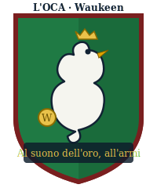
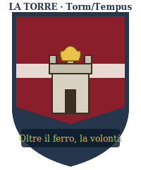
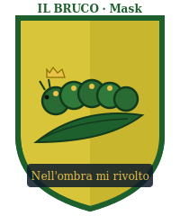
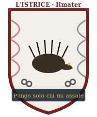
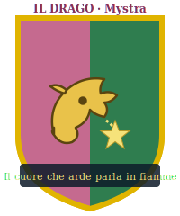
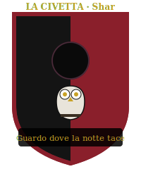
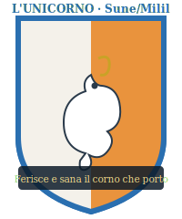
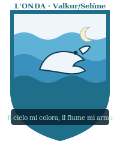

# Parte 2D — Le 8 Contrade: Stemmi, Motti, Canti, Rivalità

> Allegato di `...P2D-PALIO-DM-MASTER-REFERENCE.md`. Gli **stemmi** sono **originali**
> (arte vettoriale propria in `P2D-Palio-Allegati/stemmi/`), **non riproduzioni** di
> quelli reali di Siena. I **motti** qui usati sono **originali**, *ispirati* alla
> tradizione senese (fatti storici di pubblico dominio) ma **riscritti** per la campagna.
> Le divinità sono **faerûniane** (conversione da Golarion).

Ogni scheda: **patrono/fazione · divinità · colori · anima del rione · rivale · fantino
tipico · CANTO (con effetto meccanico) · aggancio a Rethmar (Meraviglia)**.

---

## Tavola sinottica

| Contrada | Divinità | Patrono (campagna) | Voto Consiglio | Meraviglia d'assedio |
|---|---|---|---|---|
| **L'Oca** | Waukeen | Lady Kaal | Resa | — (vittoria Oca = resa) |
| **La Torre** | Torm/Tempus | Jarmaath + Sorvane | Difesa | Golem d'Assedio |
| **Il Bruco** | Mask | Varis "Seta-Argento" | *(esterno)* | Piaga Chimica dei Canali |
| **L'Istrice** | Ilmater/Chauntea | Cap. Lorana (profughi) | Difesa (non uff.) | Mythal della Selva Viva |
| **Il Drago** | Mystra | Maester Pyriel | Astensione | Quasi-Mythal Perfetto (anti-drago) |
| **La Civetta** | Shar | Conte Valerius | *(esterno)* | Muri Illusori |
| **L'Unicorno** | Sune/Milil | Aldric Thornwall | Volatile | Arpa della Tempesta Bardica |
| **L'Onda** *(NEW)* | Valkur/Selûne | Gonfaloniere + Gilda dei Barcaioli | *(host city)* | La Marea Montante (flotta + piena) |

> **Halveth (corrotto)** non ha contrada: **finanzia l'Oca**. Smascherarlo = effetto uguale
> alla sua rimozione dal Consiglio (INTEGRAZIONE §2).

---

## 1 · L'OCA — *"Al suono dell'oro, all'armi"*

- **Divinità**: Waukeen (commercio, ricchezza). **Colori**: verde e bianco bordati di rosso.
- **Patrono**: **Lady Kaal**, Presidente del Consiglio. **Anima**: aristocrazia terriera e
  banchieri; il rione più ricco, dai palazzi ordinati e freddi.
- **Rivale**: la Torre. **Fantino tipico**: **Cavaliere** mercenario d'élite, speroni d'oro.
- **CANTO — "L'Aria dei Conti"**: melodia elegante, quasi liturgica del mercato.
  *Effetto*: se vinto, apre un **partito commerciale** extra (oro/mercenari); tema
  **disfattista** — può infliggere **−1 Morale** a un rione a scelta ("Rethmar è già persa").
- **A Rethmar**: se l'Oca **vince il Palio → il Consiglio vota RESA** (branch disastro,
  CONSEGUENZE §Oca). Nessuna Meraviglia.
- **Nota Salvatore**: Kaal non è una vigliacca — è una contabile del dolore. Ha *già
  calcolato* quanti moriranno in un assedio e ha deciso di non pagare quel prezzo. Darle
  torto richiede darle **numeri migliori**, non insulti.

## 2 · LA TORRE — *"Oltre il ferro, la volontà"*

- **Divinità**: Torm (dovere) / Tempus (guerra). **Colori**: amaranto listato di bianco e azzurro.
- **Patrono**: **Lord Jarmaath** (militare) + **Cap. Brenna Sorvane** (milizia).
  **Anima**: veterani, fabbri d'armi, milizia pesante; taverne che sanno di fumo e olio d'armi.
- **Rivale**: l'Oca. **Fantino tipico**: **Cavaliere** d'acciaio, iper-disciplinato.
- **CANTO — "Inno delle Cento Asce"** *(eco di Hammerfist!)*: marziale, batte come un tamburo.
  *Effetto*: se vinto, **+1 Morale** e ai difensori evocati dà **+ vs paura**; ai PG reduci
  di Hammerfist: **+2 al canto** (riconoscono l'inno).
- **A Rethmar**: **unica** contrada che risveglia i **Golem d'Assedio** (Meraviglia canonica).
  Voto **Difesa compatta**; +cavalleria pesante di Channathgate.

## 3 · IL BRUCO — *"Nell'ombra mi rivolto"*

- **Divinità**: Mask (ombre, furto, segreti — **già in campagna**, arco Zalkatar/Artemis).
  **Colori**: giallo e verde listati d'azzurro.
- **Patrono**: **Maestro Varis "Seta-Argento"** (mercato nero). **Anima**: ricettatori,
  contrabbandieri, la mala urbana; vicoli dove ogni porta ha due chiavi.
- **Rivale**: la Civetta. **Fantino tipico**: **Ladro** spietato, aghi nel nerbo.
- **CANTO — "Filastrocca del Nervo"**: allegra e minacciosa; i bambini la cantano, i sicari
  la fischiano. *Effetto*: se vinto, **Scosso** al rivale + i PG ottengono una **dritta**
  (dove colpirà il sabotaggio nemico).
- **A Rethmar**: **Piaga Chimica dei Canali** (chiuse alchemiche gnomiche: fuoco liquido nei
  fossati) + sabotaggio logistico dell'orda. **Prezzo**: Varis vuole contrabbandare **statue
  pietrificate** fuori dalle mura (aggancio Il Collezionista).

## 4 · L'ISTRICE — *"Pungo solo chi mi assale"*

- **Divinità**: Ilmater (sofferenza) / Chauntea (comunità). **Colori**: bianco con arabeschi
  rosso, nero, azzurro; nello stemma, **catene spezzate** (i profughi liberati).
- **Patrono**: **Capitana Lorana** e gli ~800 **profughi di Tretino/Drellin**. **Anima**:
  disperati accampati nei sobborghi, guardati con sospetto dai ricchi; il rione che non
  dovrebbe nemmeno avere un cavallo.
- **Rivale**: l'Oca (che li vorrebbe cacciare). **Fantino tipico**: un giovane profugo che
  monta **a pelo**, spinto dalla disperazione — o un Ranger.
- **CANTO — "Il Lamento del Traghetto"**: struggente, in minore; parla dei morti di
  Drellin's Ferry. *Effetto*: se vinto, **+2 Morale** e **cura 1d8 "morale"** al rione;
  fa **piangere la piazza** (Diplomazia +2 verso i popolani per una scena).
- **A Rethmar**: **Mythal della Selva Viva** (radici/spine dalle mura, trincee semoventi) +
  **800 profughi** a tenaglia. Se l'Istrice **vince**, Lorana ottiene **seggio permanente** → voto Difesa.
- **⚠️ Sub-ramo Ghostlord (+600 non-morti "buoni") — condizionale e gated**: il Ghostlord
  **non aiuta i profughi** (non gliene importa: è un lich). Canalizza la Selva Viva **solo se
  i PG hanno già stretto il PATTO** in `...P3-Ghostlord-LICH-ALLEANZA-TESTO.md` — cioè
  possiedono la sua **filatteria** e lo trattano da **alleato, non da schiavo soggiogato**.
  Motivo in-fiction: è un **lich druidico**, affine a un Mythal *di natura*, e onora il patto
  (non la pietà). Senza quel ramo, la Selva Viva funziona **coi soli arcidruidi del Circolo
  degli Otto** — nessun +600. Se il Ghostlord è ostile/soggiogato/insultato, **niente
  contributo** (e, come da suo arco, l'Orda guadagna semmai ondate di non-morti).
- **Nota Salvatore**: la loro forza è la disperazione, che è anche la loro rovina — il
  fantino profugo potrebbe **uccidere** un rivale per vendetta, non solo disarcionarlo.

## 5 · IL DRAGO — *"Il cuore che arde parla in fiamme"*

- **Divinità**: Mystra (magia). **Colori**: rosa/rosso e verde listati di giallo; nello
  stemma, un drago avvolto attorno alla **stella di Mystra**.
- **Patrono**: **Maester Pyriel** (sapere/accademia). **Anima**: speziali, alchimisti,
  maghi di corte; il rione profuma di zolfo e pergamena.
- **Rivale**: la Civetta (che ruba i loro segreti). **Fantino tipico**: un Magus, o un
  fantino dopato con **pozioni alchemiche illegali** di potenziamento.
- **CANTO — "Le Sette Note della Trama"**: eterea, in scala arcana; chi ha ranghi in
  Sapienza Magica la canta meglio. *Effetto*: se vinto, **+ vs magia** ai difensori e
  rende **−1/−2** più facili le disruzioni rituali (Fase 2 di Rethmar).
- **A Rethmar**: **Quasi-Mythal Perfetto** — cupola argentea che **inchioda a terra i
  draghi** (Abithriax/Tyrgarun) e scherma i bombardamenti. **−1 GS** ondate aeree Fase 1.

## 6 · LA CIVETTA — *"Guardo dove la notte tace"*

- **Divinità**: Shar (perdita, vendetta, segreti). **Colori**: nero e rosso listati di
  bianco; nello stemma, la civetta davanti al **disco nero di Shar**.
- **Patrono**: **Conte Valerius** (nobiltà decaduta). **Anima**: burocrati, spie,
  parassiti di corte; palazzi che cadono a pezzi dietro facciate d'oro.
- **Rivale**: il Bruco e il Drago. **Fantino tipico**: un Investigatore/sicario nobiliare,
  che **distrae gli arbitri** con la dialettica prima della Mossa.
- **CANTO — "La Ninna dell'Ombra"**: sussurrata, ipnotica. *Effetto*: se vinto, riduce la
  **Percezione** degli avversari (spie e alfieri rivali) per una scena — copre i sabotaggi.
- **A Rethmar**: **Muri Illusori del Disorientamento** (mura in posizioni errate) — potenti
  **ma** Valerius resta un traditore: se non ricattato/neutralizzato, in Fase 2/3 può
  **aprire una breccia**. Esito **ambiguo** (CONSEGUENZE §Civetta).

## 7 · L'UNICORNO — *"Ferisce e sana il corno che porto"*

- **Divinità**: Sune (bellezza) / Milil (canto). **Colori**: bianco e arancio listati
  d'azzurro; nello stemma, il corno dell'unicorno a forma di **spirale d'arpa**.
- **Patrono**: **Aldric Thornwall** (gilde/artigiani). **Anima**: sarti, falegnami,
  menestrelli; il rione più bello e il più codardo — vuole solo che la guerra "passi oltre".
- **Rivale**: nessuna fissa — **ago della bilancia**. **Fantino tipico**: un Bardo o un
  acrobata circense abilissimo a **schivare** le nerbate.
- **CANTO — "L'Aria del Corno"**: dolce, virtuosistica; il capolavoro dei bardi cittadini.
  *Effetto*: se vinto, **cura 1d8 morale** a tutto il rione e concede **Ispirare Coraggio**
  di massa; è il **canto-chiave** per la Meraviglia dell'Arpa.
- **A Rethmar**: **Arpa della Tempesta Bardica** (onda sonora sulle mura: + vs paura,
  fulmini sonici) + logistica/fortificazioni immense.

## 8 · L'ONDA *(NUOVA)* — *"Il cielo mi colora, il fiume mi arma"*

- **Divinità**: Valkur (marinai, vento favorevole) / Selûne (luna, navigazione).
  **Colori**: bianco e celeste; nello stemma, un **luccio fluviale** saltante su tre onde
  sotto una **falce di Selûne**.
- **Patrono**: il **Gonfaloniere di Channathgate** e la **Gilda dei Barcaioli** — è la
  **contrada di casa**, l'unica non legata a una fazione di Rethmar. Molti barcaioli
  dell'Onda sono **gli stessi che traghettarono i profughi** giù dal Cannath: legame
  segreto con l'Istrice.
- **Anima**: barcaioli, pescatori, portuali, sognatori del fiume; gente allegra e
  scaramantica che legge il tempo nel cielo. **Rivale**: nessuna storica (sono "di tutti e
  di nessuno") — ma **disprezzano l'Oca** che specula sui dazi del porto.
- **Fantino tipico**: un giovane barcaiolo temerario, leggerissimo (bonus Cavalcare su
  fondo bagnato), o un chierico di Valkur che "sente il vento".
- **CANTO — "La Barcarola del Guado"**: ritmo di remi, ritornello che tutta la piazza sa
  cantare. *Effetto*: se vinto, **+2 Morale** *contagioso* (può estendersi anche all'Istrice
  se alleate); protegge dai **temi acquatici** (annegamento, fuoco liquido) in corsa se
  piove/fango.
- **A Rethmar — Meraviglia: "LA MAREA MONTANTE"**: l'Onda arma la **flotta fluviale** di
  Channathgate — chiatte da guerra e zattere-ariete che **scendono il Cannath** fino a
  Rethmar (corrente a favore, ~1 giorno) portando **rifornimenti e ~250 marinai-arcieri**;
  e i barcaioli **aprono le chiuse a monte** per **allagare le vie d'approccio** dell'orda
  ai guadi (le colonne di giganti/lucertoloidi restano impantanate). *Effetto assedio*:
  **−1 GS Fase 1** (approccio allagato) **+ rifornimenti garantiti** (come Thornwall) **+
  via di fuga/evacuazione fluviale** per i civili (riduce la pressione di Fase 3).
  Se l'Onda **vince**, il Gonfaloniere **firma subito il Decreto d'Intervento** (è la
  contrada che controlla porto e magazzini): sblocco logistico immediato.
- **Perché è bella per i PG**: l'Onda è la scelta "**salvare tutti**" — meno spettacolare
  in battaglia dei Golem, ma è l'unica Meraviglia che **evacua i civili** e apre la strada
  a un **finale senza massacro**. Tema Salvatore: la vittoria più silenziosa è salvare chi
  non combatte.

---

## Rivalità (mappa dei coltelli)

```
        OCA ⟺ TORRE            (ricchezza vs acciaio)
        OCA ⟶ ISTRICE          (i ricchi vogliono cacciare i profughi)
   BRUCO ⟺ CIVETTA             (due mafie per lo stesso mercato)
   DRAGO ⟺ CIVETTA             (chi ruba i segreti a chi)
        ONDA ⟶ OCA             (dazi del porto)
   UNICORNO = neutrale         (si vende al vincitore)
   ONDA ~ ISTRICE              (alleanza segreta dei salvati)
```

Usa le rivalità per i **partiti**: proporre a un rione di **far perdere il suo nemico** è
spesso più efficace che offrirgli di vincere.

---

## Nota grafica — upgrade delle figure degli stemmi (opzionale)
Gli scudi (`P2D-Palio-Allegati/stemmi/*.svg`) sono **originali** e ridisegnati in stile
araldico piatto unificato. Se vuoi figure **ancora più rifinite mantenendo lo stesso stile
fantasy e senza problemi di copyright**, l'opzione migliore e coerente è **game-icons.net**:
migliaia di icone SVG monocromatiche, **stesso tratto**, licenza **CC BY 3.0** (gratis, con
**attribuzione**). Sono `<path>` che si incollano dentro gli scudi al posto della figura
attuale. Mappatura consigliata:

| Contrada | Icona game-icons.net (nome) | Autore tipico |
|---|---|---|
| Oca | `goose` / `duck` | Delapouite |
| Torre | `tower` / `defensive-wall` | Delapouite / Lorc |
| Bruco | `caterpillar` / `worms` | Lorc |
| Istrice | `hedgehog` / `porcupine` | Delapouite |
| Drago | `dragon-head` / `spiked-dragon-head` | Lorc |
| Civetta | `owl` | Delapouite |
| Unicorno | `unicorn` | Delapouite / Caro Asercion |
| Onda | `jumping-dog`→ meglio `salmon`/`fish` + `moon` | Delapouite / Lorc |

**Attribuzione da includere** (es. in un `CREDITS.md`): *"Alcune icone da game-icons.net
(Lorc, Delapouite, Caro Asercion), CC BY 3.0."* — Dimmi "usa game-icons" e le integro io
negli scudi (scarico i path e li incastono, tenendo cornici e colori attuali).

## Nota IP (ripetuta qui per chiarezza)
Nomi delle contrade e riferimenti al Palio = **fatti storico-culturali** citati come
ispirazione. **Motti e stemmi di questo documento sono originali** (riscritti/ridisegnati):
si evita così qualsiasi riproduzione dell'iconografia moderna tutelata dal *Consorzio per
la Tutela del Palio di Siena*. Uso non commerciale, da tavolo.
