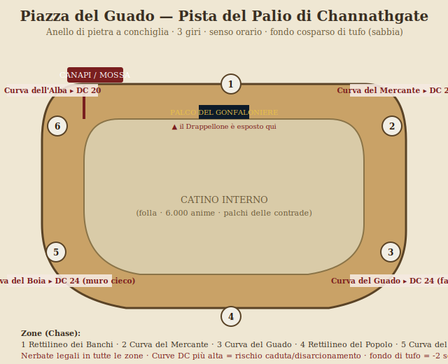
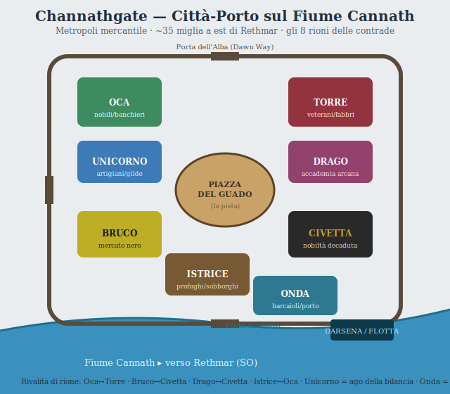
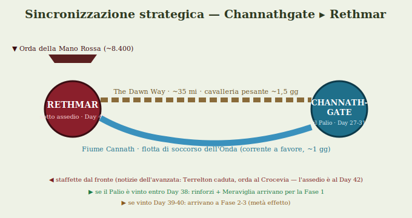
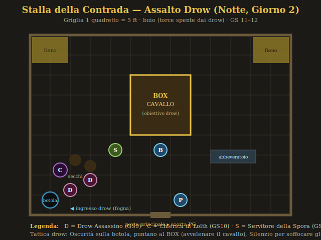

# Parte 2D — Mappe e Note Tattiche

> Allegato di `...P2D-PALIO-DM-MASTER-REFERENCE.md`. Le mappe sono file **SVG** originali in
> `P2D-Palio-Allegati/mappe/` (apribili nel browser, stampabili, scalabili senza perdita).

---

## 1. La Piazza del Palio — pista e Zone di inseguimento
**File**: `P2D-Palio-Allegati/mappe/piazza-del-palio.svg`

Anello a **conchiglia**, senso **orario**, **3 giri**, fondo di **tufo**. Sei Zone (Chase),
quattro curve pericolose (dettaglio regole in GIORNO3-4 §4):
- **Zona 1** Rettilineo dei Banchi (DC 18) — sorpassi/nerbate.
- **Zona 2** Curva del Mercante (DC 22).
- **Zona 3** Curva del Guado (DC 24, fango se piove) — la più letale.
- **Zona 4** Rettilineo del Popolo (DC 18) — la folla lancia oggetti ai fantini odiati.
- **Zona 5** Curva del Boia (DC 24, **muro cieco**: caduta 4d6) — dove il Ladro colpisce.
- **Zona 6** Curva dell'Alba (DC 20).
- **Canapi/Mossa** e **Palco del Gonfaloniere** (col Drappellone) segnati in mappa.

**Note tattiche**: il **catino interno** è pieno di folla (6.000): un fantino disarcionato
che ci finisce è "salvo" ma fuori gara; un PG a piedi può muoversi nella ressa (Acrobazia).

---

## 2. Channathgate — la città e gli otto rioni
**File**: `P2D-Palio-Allegati/mappe/channathgate-citta.svg`

Città-porto sul **Fiume Cannath** (~35 mi a est di Rethmar). Mura, **Porta dell'Alba**
(Dawn Way), **Porta del Porto**, **Darsena/Flotta** (Onda). Otto rioni-contrada attorno
alla **Piazza del Guado** centrale. Usa questa mappa per: gli spostamenti fra rioni per i
**partiti**, l'infiltrazione nel palazzo della **Civetta** (registri di Valerius), la
**stalla** dei PG (assalto drow) e il **porto** (Meraviglia dell'Onda).

---

## 3. Rotta di soccorso — Channathgate ▸ Rethmar
**File**: `P2D-Palio-Allegati/mappe/rotta-soccorso.svg`

La **sincronizzazione** col fronte (INTEGRAZIONE §3): due vie per i rinforzi vinti al Palio.
- **Dawn Way** (~35 mi, ~1,5 gg): cavalleria pesante (Torre).
- **Fiume Cannath** (corrente a favore, ~1 gg): **flotta dell'Onda** (più rapida).
- **Staffette** dal fronte scandiscono il timer. **Deadline Day 38** per arrivare alla Fase 1.

---

## 4. Stalla — mappa tattica dell'assalto drow (Giorno 2 notte)
**File**: `P2D-Palio-Allegati/mappe/stalla-assalto-drow.svg`

Griglia **1 quadretto = 5 ft**, GS 11–12 (statblocchi in `...P2D-PALIO-STATBLOCCHI.md` §3).
- I drow entrano dalla **botola/fogna** (angolo SO) con *Oscurità*; puntano al **BOX** del
  cavallo (obiettivo: avvelenarlo), usano *Silenzio* per soffocare gli allarmi.
- Il **Barbaresco (B)** è accanto al cavallo; la **scorta PG (P)** copre la porta principale.
  Sorpresa se non di guardia: Ascoltare DC 20.
- Buio totale (torce spente): **Scurovisione**/luce = cruciale.
- Token in mappa: **D** Drow Assassino · **C** Chierica di Lolth · **S** Servitore della Spora.
- **Catturare un drow vivo** = intel Fase 0 Rethmar **−1 clock Sonjak** (INTEGRAZIONE §3.2).

---

### 🌍 AMBIENTE (companion T5c, consolidato dalle 4 mappe sopra)

*Questo file ha già **SVG originali** in `P2D-Palio-Allegati/mappe/` (fatti a
mano nell'arco del Palio, non dalla pipeline `render_map_svg`) + note tattiche
per mappa. Companion di raccordo:*

| Mappa | SVG | Elementi chiave |
|---|---|---|
| **Piazza del Palio** (corsa) | `piazza-del-palio.svg` | anello a conchiglia, orario, 3 giri, tufo; 6 Zone con DC 18-24 (Curva del Guado DC 24 = la più letale; Curva del Boia = muro cieco, caduta 4d6); catino interno = folla (6.000) |
| **Channathgate città** | `channathgate-citta.svg` | 8 rioni-contrada, Porta dell'Alba/del Porto, Darsena; spostamenti dei partiti, infiltrazione Civetta, porto |
| **Rotta di soccorso** | `rotta-soccorso.svg` | Dawn Way (~35 mi, 1,5 gg, cavalleria) vs Fiume Cannath (~1 gg, flotta); **deadline Day 38** per la Fase 1 |
| **Stalla — assalto drow** | `stalla-assalto-drow.svg` | 1 quadretto = 5 ft, GS 11-12; drow dalla botola SO con *Oscurità/Silenzio*, buio totale |

### ⚔️ TATTICHE (companion T5c)

- **Corsa (skill-challenge/chase)**: le 6 Zone con DC crescenti (sorpassi/nerbate; la folla lancia oggetti ai fantini odiati in Zona 4; il Ladro colpisce alla Curva del Boia). Un fantino disarcionato nel catino è "salvo" ma fuori gara.
- **Assalto alla stalla (tattico, notte Giorno 2)**: i drow puntano al **BOX** del cavallo (avvelenarlo); Barbaresco accanto, scorta PG alla porta; **Scurovisione/luce cruciale** (buio totale); sorpresa se non di guardia (Ascoltare DC 20). **Catturare un drow vivo → −1 clock Sonjak** (Fase 0 Rethmar).
- Statblocchi: `...P2D-PALIO-STATBLOCCHI.md`.

### 🔄 EVOLUZIONE (companion T5c — Palio → rinforzi al fronte)

| Stato | Trigger | Cosa cambia | Effetto |
|---|---|---|---|
| A — Giorni di gara + intrighi | i partiti manovrano | spostamenti fra rioni, sabotaggi | posiziona alleanze e rischi |
| B — Assalto alla stalla (notte G2) | i drow colpiscono il cavallo | scontro al box | vincere protegge la corsa; drow vivo = intel |
| C — Corsa (3 giri) | giorno della gara | le 6 Zone con i loro DC | vittoria = rinforzi vinti |
| D — Soccorso a Rethmar | fine Palio | rotta Dawn Way / Fiume | rinforzi arrivano **entro Day 38** o mancano la Fase 1 |

> Esiti aperti (D13): chi vince il Palio, se la stalla regge e per quale rotta
> arrivano i rinforzi dipende dalle scelte dei PG e dai dadi.
