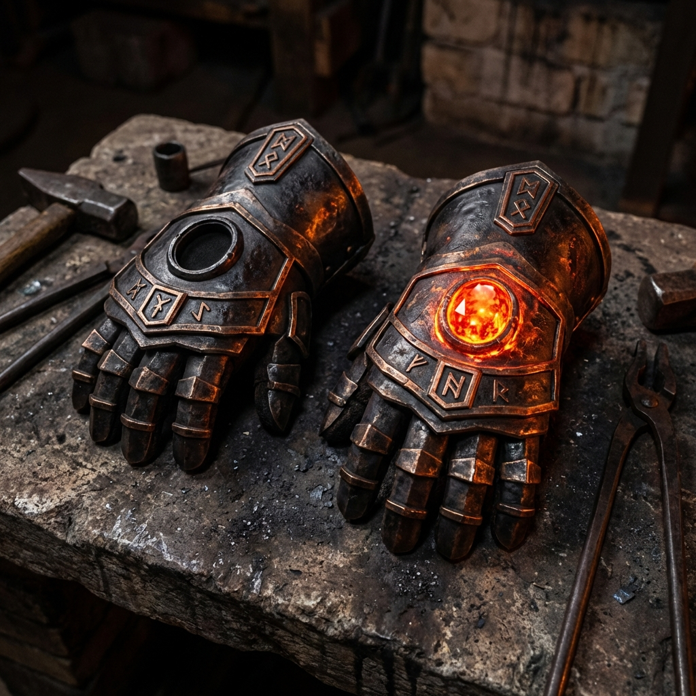

# Bracieri Gemelli di Moradin (Risveglio della Fiamma)

**Aura:** Forte Evocazione e Invocazione [Legale, Buono]
**Livello Incantatore:** 20°
**Slot:** Mani
**Peso:** 2,5 kg
**Valore:** Artefatto (Stato Risvegliato)

---

## Descrizione Fisica

> *"Una forgia senza fuoco non crea."*

Coppia di guanti di adamantio annerito, lavorati come piastre sovrapposte a imitare nocche e falangi di un gigantesco pugno nanico.
*   **Guanto Sinistro:** Sul dorso è incastonata una gemma **Topazio-Fuoco**, pulsante come una fornace.
*   **Guanto Destro:** Il dorso presenta un incavo vuoto e scuro, in attesa di essere riempito.

*   **Rune:** Iscrizioni naniche circondano le gemme, brillando di un bagliore bronzeo quando il portatore chiude i pugni.
*   **Sensazione:** Al tocco non scottano, ma emanano un calore secco e costante. Indossarli trasmette una sensazione di calma inflessibile, come un vecchio fabbro che osserva il lavoro in silenzio.
*   **Reazione:** Quando colpiscono, lasciano scie di scintille nell'aria.

## Storia & Risveglio

Prima che la Forgia Eterna fosse una sala, Moradin sollevò dalla roccia due blocchi di adamantio rovente. Li immerse nel magma del Piano del Fuoco finché non bevvero la furia delle fiamme.

Questi guanti, dimenticati per eoni, sono stati recuperati e portati nel **Piano Elementale del Fuoco**. Lì, attraverso il sacrificio e il coraggio, hanno assorbito l'essenza di un *Cuore Ardente* elementale, risvegliando la loro prima natura: quella del **Fuoco che Consuma**.

---

## Poteri (Stato Fuoco)

### Poteri Costanti (Passivi)
Questi poteri sono sempre attivi finché i guanti sono indossati da un nano degno.

*   **Castigo del Drago (Dragon Doom) (Su):**
    *   I guanti possiedono la proprietà *Nemesi dei Draghi*.
    *   Contro draghi (e sottotipo drago), il bonus di potenziamento sale di **+2** e infliggi **+2d6 danni** extra.
*   **Maestria dell'Attacco Poderoso (Ex):**
    *   Quando usi Attacco Poderoso con colpi senz'armi o armi naniche, riduci la penalità al tiro per colpire di **1**. (*Esempio: dichiari -4, tiri come -3, ma danni come -4*).
*   **Cariche di Devastazione (Su):**
    *   I guanti possiedono 3 cariche di devastazione rinnovabili ogni giorno al tramonto (o dopo 8 ore di riposo forgiato nella preghiera a Moradin).
    *   Ogni volta che il portatore conferma un critico in mischia, può scegliere di spendere 1 o più cariche per aumentare il danno:
        *   1 carica: **+2d6 danni da forza**.
        *   2 cariche: **+3d6 danni da forza**.
        *   3 cariche: **+4d6 danni da forza**.
    *   Dopo aver speso cariche, il guanto “chiede” altro sangue: il Possessore del l'ogetto tira subito un nuovo d20. Se il risultato è 18-20 naturale, il guanto assorbe la furia della battaglia e ricarica gratuitamente 1 carica (non può superare il massimo giornaliero di 3).
*   **Cuore di Brace (Su):**
    *   Ottieni **Resistenza al Fuoco 10**.
    *   Ignori gli effetti ambientali da calore eccessivo (forgie, magma, ecc.) finché il danno per round non supera 10.
*   **Passo di Brace (Ember Step) (Su):**
    *   Ottieni un bonus di potenziamento di **+3 m** alla velocità base di movimento a terra finquando hai a disposizione almeno 1 uso di **Salto Fiammegiante**.
    

### Poteri Attivati (Combattimento)

#### 1. Pugni di Magma (Su) (3/Giorno)
*   **Azione:** Veloce (Swift).
*   **Effetto:** Per **1 round**, i tuoi colpi grondano magma.
    *   Aggiungi il tuo **Bonus Saggezza** come danni da **Fuoco** a tutti i colpi senz'armi.
    *   I nemici colpiti devono superare **TS Tempra CD 18** o essere **Infermi (Sickened)** per 1 round (causa fumo e calore).

#### 2. Colpi del Fuoco (Su) (3/Giorno)
*   **Azione:** Standard (Attacco in mischia).
*   **Effetto:** Un colpo devastante che libera l'energia del Piano del Fuoco.
    *   **Danni:** Colpo normale + **4d6 Fuoco**.
    *   **Impatto:** Bersaglio deve superare **TS Tempra CD 18** o essere spinto 1,5m.
    *   **Esplosione:** Tutte le creature adiacenti al bersaglio subiscono **2d6 Fuoco** (Riflessi CD 18 dimezza).

#### 3. Salto Fiammegiante (Su) 

*   **Utilizzi:** 3/giorno
*   **Azione:** Azione di movimento (serve un attimo per “convogliare” le **energie del piano del fuoco** sotto di te)

**Descrizione:**
Ti fermi un istante, piantando i piedi a terra mentre il calore si concentra sotto di te, vapore e scintille che salgono in colonne rosso-arancio. Poi il fuoco esplode, proiettandoti in aria in un singolo salto impossibile, molto oltre i limiti normali, e atterri in un boato che genera un anello di fiamme di 3 m attorno al punto d’impatto.

---

##### Dettagli del Potere: Salto Fiammeggiante

**1) Attivazione e Tiro**
Ignora regole normali. Unico tiro: **1d20 + Mod. Forza + Gradi in Saltare**.

**2) Calcolo della Distanza**
*   **Salto Verticale:** `(1,5 m × ⌊tiro/10⌋) + (1,5 m × Mod. Sag) + (1,5 m x (per ogni 3m di velocità oltre i 12m))`
*   **Salto Orizzontale:** `(3 m × ⌊tiro/10⌋) + (3 m × Mod. Sag) + (3 m x (per ogni 3m di velocità oltre i 12m))`

**3) Anello di Fuoco all’Arrivo**
Quando atterri, generi un'esplosione di fiamme:
*   **Area:** Raggio di 3 m (2 quadretti) dal punto di impatto.
*   **Danni:** **2d6 Fuoco** a tutte le creature nell'area (tranne te).
*   **Tiro Salvezza:** Riflessi dimezza. **CD = 10 + 1/2 Livello + Mod. Saggezza**.

---

**Esempio Pratico:**
*   **Livello:** Monaco - Livello 10 - velocita 9 + 6 metri di incremento
*   **Dati:** Tiro Totale (1d20+For+Saltare) = **27** (quindi 2 blocchi completi da 10). Mod. Saggezza = **+3**.
*   **Salto Verticale:** (1,5m × 2) + (1,5m × 3) + (1,5m x ((15-12)/3)) = 3m + 4,5m + 1,5m  = **9 m**
*   **Salto Orizzontale:** (3m × 2) + (3m × 3) + (3m x ((15-12)/3)) = 6m + 9m + 3m = **18 m**
*   **Impatto:** Atterrando, infliggi 2d6 fuoco in un raggio di 3m **CD = 10 + (10 Livello)/2 + 3 Mod. Saggezza**.

---

## Senzienza: La Voce nella Forgia
I guanti possiedono una rudimentale coscienza (**Ego 12**).
Non parlano, ma trasmettono concetti: *disciplina, calore, martello*. Occasionalmente sussurrano suggerimenti in nanico antico.
Disprezzano l'indecisione e la codardia. Rifiuteranno i loro poteri se il portatore fugge o disonora la forgia.
