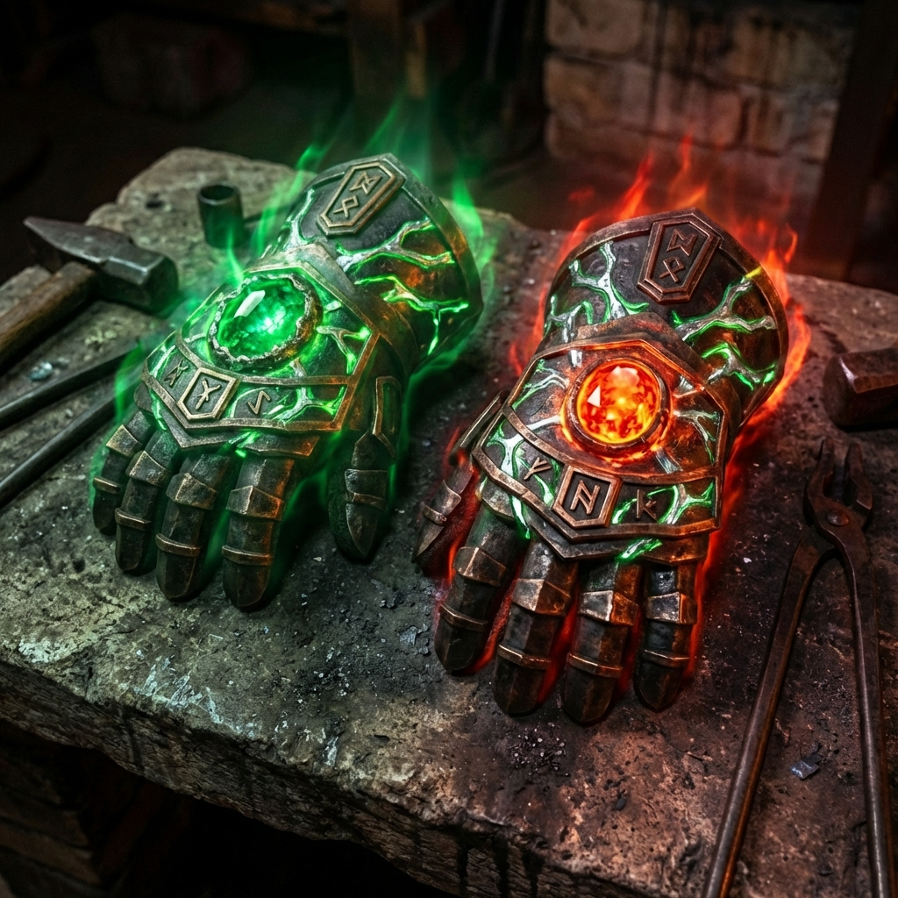

# Bracieri Gemelli di Moradin (Risveglio Completo)

**Aura:** Travolgente Evocazione, Abiurazione, Invocazione e Trasmutazione [Legale, Buono]
**Livello Incantatore:** 20°
**Slot:** Mani
**Peso:** 2,5 kg
**Valore:** Inestimabile (Artefatto Maggiore Completo)

---

## Descrizione Fisica

> *"Una forgia senza fuoco non crea, ma un fuoco senza pietra non dura."*

I guanti d'adamantio sono mutati. Ora, venature di **Mithral** puro e **Cristallo di Smeraldo** corrono lungo le piastre nere, intrecciandosi con le rune di fuoco.
*   **Destra:** Domina il **Topazio-Fuoco**, pulsante di energia distruttiva.
*   **Sinistra:** Domina il **Geode di Smeraldo**, stabile e profondo come il cuore di una montagna.
*   **Risonanza:** Quando i guanti si toccano, producono un suono puro, non metallico, ma simile a due placche tettoniche che si assestano.

## Storia & Leggenda

Prima che la Forgia Eterna fosse una sala, Moradin sollevò dalla roccia due blocchi di adamantio. Li immerse nel magma del Piano del Fuoco finché non bevvero la furia delle fiamme, poi li incatenò al cuore del Piano della Terra perché imparassero il peso della montagna.

Quando emersero dall'Incudine del Mondo, non erano più semplici placche, ma pugni. Pugni foggiati per coloro che scelgono di combattere con il proprio corpo.

Leggenda narra che un solo nano monaco, con questi guanti, insegnò a un drago antico la differenza tra possedere una montagna e meritarla. Oggi, quella leggenda rivive nelle tue mani.

---

## Poteri (Stato Completo: Fuoco & Terra)

### Poteri Costanti (Passivi)
La presenza della Terra stabilizza la furia del Fuoco, concedendo protezioni supreme.

*   **Pelle di Scorie e Pietra:** Ottieni **RD 5/adamantio**. La tua pelle è dura come la roccia.
*   **Cuore di Brace:** Resistenza al Fuoco 10.
*   **Castigo del Drago:** *Nemesi dei Draghi* (+2 TxC / +2d6 danni vs Draghi).
*   **Maestria dell'Attacco Poderoso:** Penalità ridotta di 1 all'Attacco Poderoso.
*   **Vista della Galleria:** Entro 9m, percepisci automaticamente crepe/instabilità nella pietra (+4 a cercarle).
*   **Cammino nella Tempesta:** Nessuna penalità di movimento su macerie/detriti. Bonus +2 TS contro Spingere/Sbilanciare.

### Poteri Attivati (La Danza degli Elementi)

#### 1. Pugno Frana (3/Giorno) - *NUOVO*
*   **Azione:** Standard.
*   **Effetto:** Colpisci con la forza di una valanga.
    *   **Danni:** Colpo normale + **4d6 Contundenti**.
    *   **Impatto:** Bersaglio deve superare **TS Riflessi CD 19** o cadere **Prono**.
    *   **Onda d'Urto:** Nemici adiacenti: prova Equilibrio CD 15 o cadono Proni.

#### 2. Colpi del Fuoco (3/Giorno)
*   **Azione:** Standard.
*   **Effetto:** Colpo esplosivo.
    *   **Danni:** Colpo normale + **4d6 Fuoco**.
    *   **Spinta:** TS Tempra CD 18 o spinto 1,5m indietro.
    *   **Adiacenti:** 2d6 Fuoco (Riflessi CD 18 dimezza).

#### 3. Tremore del Forgiatore (1/Giorno) - *NUOVO*
*   **Azione:** Standard (Colpisci il terreno).
*   **Effetto:** Terremoto localizzato (Raggio 6m).
    *   Creature a terra: **TS Riflessi CD 18** o cadono **Prone** e subiscono **2d6 Contundenti**.
    *   Strutture fragili subiscono danni doppi.

#### 4. Ancoraggio della Montagna (2/Giorno) - *NUOVO*
*   **Azione:** Immediata.
*   **Effetto:** Quando verresti spinto/mosso contro volontà, diventi inamovibile.
    *   Ignori il movimento forzato.
    *   +4 TS contro l'effetto scatenante.

#### 5. Pugno di Moradin (3/Giorno)
*   **Azione:** Veloce.
*   **Effetto:** **+Bonus Saggezza** ai danni (Sacri) per 1 round. Spinta (Tempra CD 18).

#### 6. Salto Infuocato (3/Giorno)
*   **Azione:** Movimento.
*   **Effetto:** Salto prodigioso (calcolato su Tiro Unico) + Anello di Fuoco all'atterraggio (3m raggio, 2d6 danni).

---

## Sinergie Elementali (Fuoco + Terra)

L'unione dei due piani sblocca il vero potenziale distruttivo dell'artefatto.

### Martello di Fuoco e Pietra (Critico)
Una volta per round, quando metti a segno un **Critico Confermato** usando Attacco Poderoso, puoi attivare **Gratuitamente** uno degli effetti di impatto (senza consumare usi giornalieri):
*   **Fuoco:** Effetto di *Colpi del Fuoco* (Danni ad area + Spinta).
*   **Pietra:** Effetto di *Pugno Frana* (Danni extra + Atterramento).

---

## Senzienza: Il Maestro della Forgia
L'Ego dell'artefatto è cresciuto (**Ego 18**). Non è più solo una voce; è una guida.
Richiede che il portatore agisca come un pilastro per la sua gente. Non tollera la codardia, il tradimento o l'alleanza con i nemici giurati dei Nani.
Se soddisfatto, i guanti possono occasionalmente agire di propria volontà per proteggere il portatore (parare un colpo critico, stabilizzare una presa).
